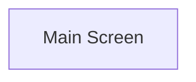


This is a MVVM implementation of the shuriken timeline window

Views and ViewModels are mirrored hierarchies, each parent handles creation or binding of its children

for example:

TrackGroupViewModel handles TrackInfoViewModel and TrackViewportViewModel

at the same time,

TrackGroupView handles TrackInfoView and TrackViewportView

Parent views pass current Viewmodel to child view bind, parent view models have standardized way of accessing children viewmodels for 
children views to bind themselves, in case of dynamic containers, events existing in parent viewmodels pass directly child viewmodels to
child views in creation time

## Navigation

